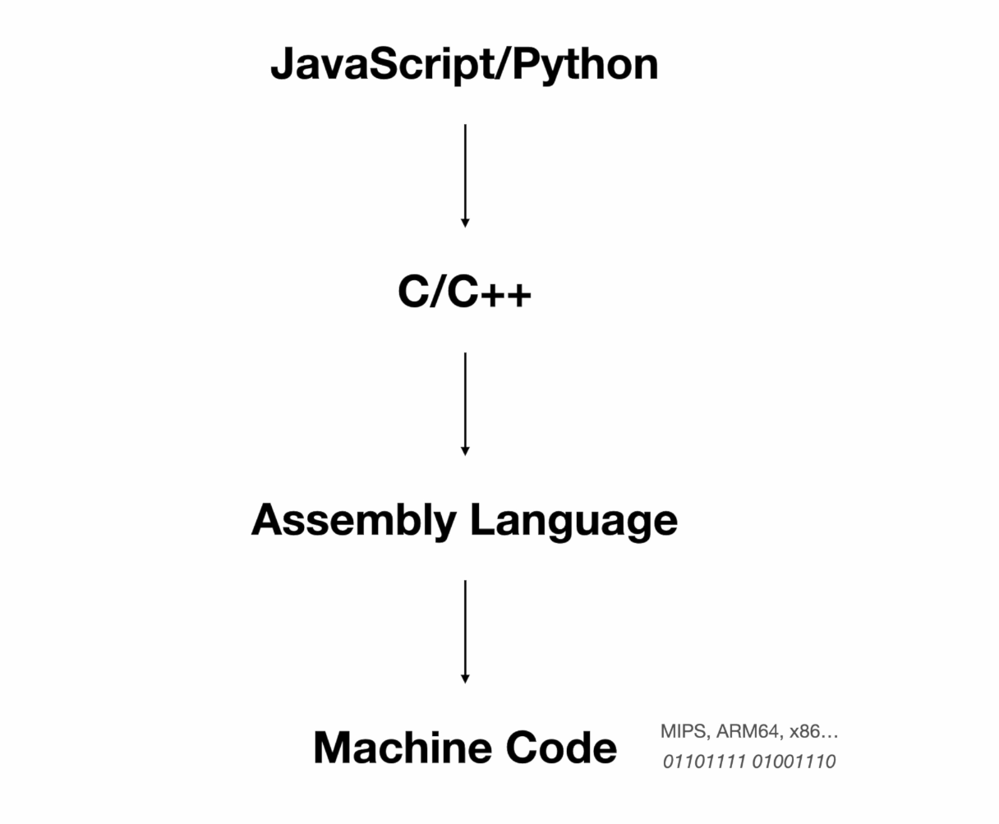
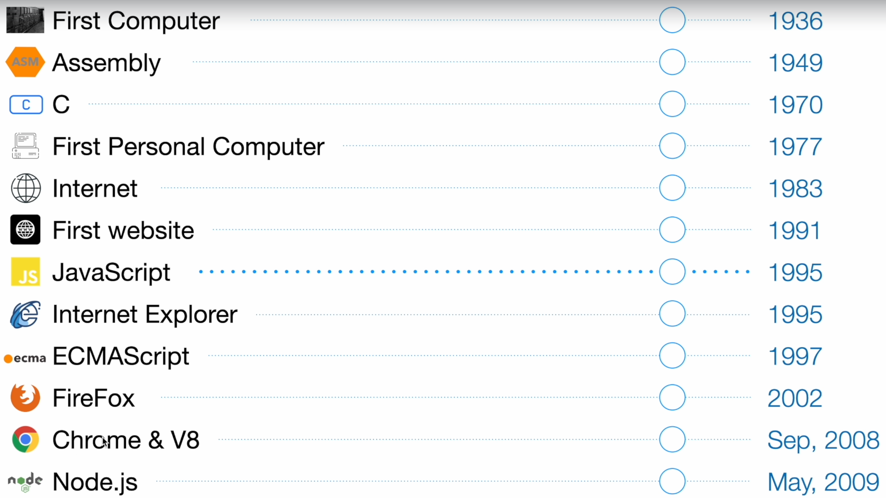
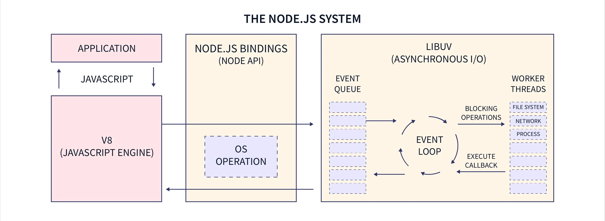

## How does NodeJS work?

- Assembly -> Machine Code

  - Checkout assembly-demo folder, first generate an object file using the `HelloWorld.s` program using the GNU assembler `as -o HelloWorld.o HelloWorld.s`, then generate the final binray using the GNU linker `ld`, remember to specify the target platform and cpu architecture.

- C++ -> Asssembly using `g++` compiler

  - C/C++ are very powerful and they can basically do anything with the underlying OS

- JavaScript -> Machine code using JavaScript engines like `V8` (https://github.com/v8/v8) from Google

  - NodeJS is open-source: https://github.com/nodejs/node
  - Brief history
    
  - NodeJS architecture
    
  - There are many other dependencies like openssl for tls and zlib for compression, etc (see https://github.com/nodejs/node/tree/main/deps)
  - Just like modern browsers, NodeJS provides an asynchronous event-driven JavaScript runtime. More about NodeJS [here](https://nodejs.org/en/about) and event loop [here](https://developer.mozilla.org/en-US/docs/Web/JavaScript/Event_loop)
  - Reactor Pattern: https://en.wikipedia.org/wiki/Reactor_pattern, instead of using threads-per-connection model, use the reactor pattern and dispatch incoming requests to a thread pool and invoke callbacks when finished processing. Ideal for IO intensive tasks (network, databases, external devices, etc).
